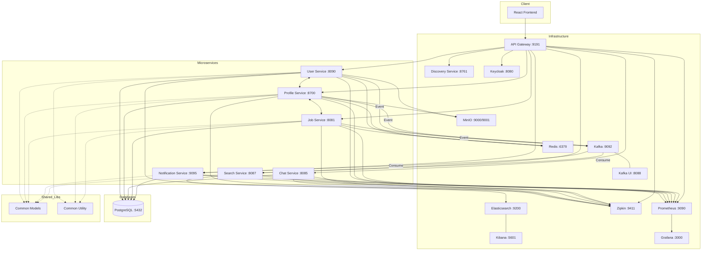

# System Architecture Graph

This document provides a visual representation of the LinkedIn clone microservices architecture.

## Component Overview

| Component | Description | Port |
| :--- | :--- | :--- |
| **Frontend** | React application providing the user interface. | 3000 |
| **API Gateway** | Entry point for all client requests, handles routing and security. | 9191 |
| **Discovery Service** | Eureka-based service discovery for microservices. | 8761 |
| **Keycloak** | Centralized identity and access management. | 8080 |
| **Kafka** | Message broker for asynchronous, event-driven communication. | 9092 |
| **Kafka UI** | Web interface for managing Kafka topics and messages. | 8088 |
| **Redis** | In-memory data store used for caching. | 6379 |
| **Elasticsearch** | Distributed search and analytics engine. | 9200 |
| **Kibana** | Visualization dashboard for Elasticsearch data. | 5601 |
| **MinIO** | Object storage for file uploads (Console on 9001). | 9000 |
| **Zipkin** | Distributed tracing system to monitor microservice latency. | 9411 |
| **Prometheus** | Monitoring system that collects metrics from services. | 9090 |
| **Grafana** | Analytics and monitoring dashboard for Prometheus metrics. | 3000 |
| **Microservices** | Domain-specific services (User, Profile, Chat, Job, Notification, Search). | Varies |
| **Common Models** | Shared JPA entities and DTOs to ensure data consistency. | - |
| **Common Utility** | Shared logic for Feign clients, Kafka publishing, and S3 storage. | - |
| **PostgreSQL** | Primary relational database for persistence. | 5432 |
